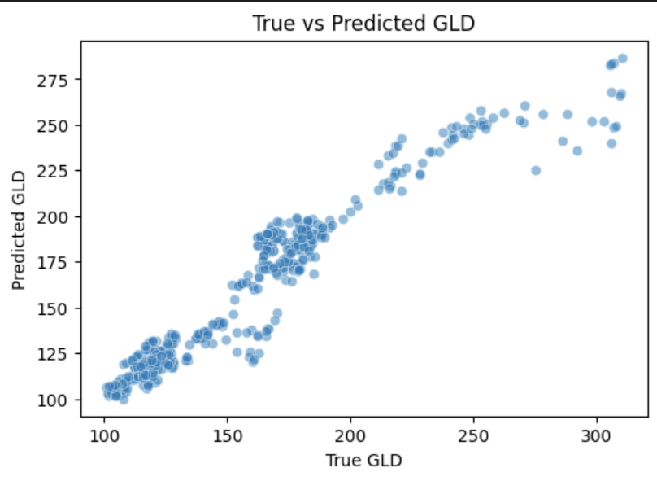
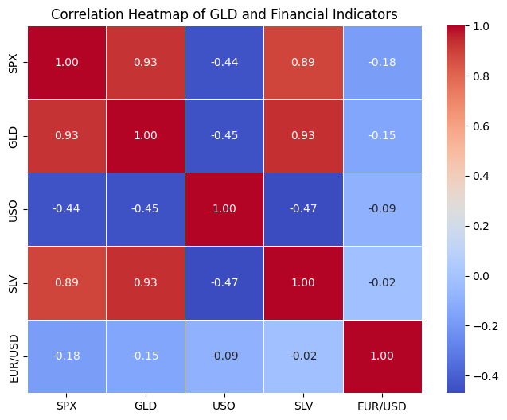

# IDS706_mini_assignment_2
[](https://github.com/xinhaozhang0819-collab/IDS706_mini_assignment_2/actions/workflows/ci.yml)
## Project Goal
This project aims to analyze gold prices (GLD) from 2015–2025 to understand annual trends, volatility, and relationships with financial indicators such as SPX, USO, SLV, and EUR/USD.  
Our goal also includes refactoring code with CI/CD best practices and demonstrating reproducible data analysis and insights.

## CSV File Description
- **File:** `gold_data_2015_25.csv`  
- **Columns:**
  - `Date` – Date in YYYY-MM-DD format
  - `GLD` – SPDR Gold Shares (gold price proxy)
  - `SPX` – S&P 500 Index
  - `USO` – Oil ETF
  - `SLV` – Silver ETF
  - `EUR/USD` – Euro to USD exchange rate

## Step 1
First create a new repository in github and clone it based on the following process (replace what's inside <> based on your url and your repository name):
```bash
git clone <repo_url>
cd <repo_name>
```
Then create a virtual environment:
```bash
python -m venv .venv
source .venv/Scripts/activate 
```
Install dependencies from requirements.txt with the following code:
```bash
pip install -r requirements.txt
```
Now you need to create a `.ipynb` file to work on the analysis.

### Repository Structure
.\
├── .github/workflows/ci.yml\
├── src/analysis_utils.py\
├── tests/test_analysis.py\
├── Analysis.ipynb\
├── requirements.txt\
├── images/\                
└── gold_data_2015_25.csv


## Step 2
1. Import & Inspect \
Import modules we needed and import the dataset. Convert `Date` to datetime, and check the structure of the dataset with `.head()`, `.info()`, `.describe()`.
```bash
import pandas as pd
import matplotlib.pyplot as plt
import seaborn as sns

df = pd.read_csv("gold_data_2015_25.csv")

df["Date"] = pd.to_datetime(df["Date"])
df = df.set_index("Date").sort_index()

df.head()
df.info()
df.describe()
```
We then clean the data using the following code, where missing values were handled with forward/backward filling.:
```bash
df.isnull().sum()
df = df.sort_values("Date")
df[["GLD","SPX","USO","SLV","EUR/USD"]] = (
    df[["GLD","SPX","USO","SLV","EUR/USD"]].ffill().bfill()
)
```

2. Filtering & Grouping
Filter GLD prices above the 75th percentile (high price periods) and group GLD by year to compute mean, std, min, max, and count.
```bash
gld_q75 = df["GLD"].quantile(0.75)
high_gld = df[df["GLD"] > gld_q75]
high_gld.head()

yearly_stats = df["GLD"].groupby(df.index.year).agg(["mean", "std", "min", "max", "count"])
yearly_stats
```
The filtering and grouping steps showed clear trends and volatility in gold prices, which implies SPX, USO, SLV, and EUR/USD may be good predictors for gold price. To test this assumption, let's do machine learning based on these variables.

## Step 3
3. Machine Learning and Visualization
Build a Linear Regression model to predict GLD from SPX, USO, SLV, and EUR/USD and evaluated using R² score and Mean Absolute Error (MAE). Here, we need to use sklearn to import `train_test_split`, `LinearRegression` and `mean_absolute_error`.
```bash
from sklearn.model_selection import train_test_split
from sklearn.linear_model import LinearRegression
from sklearn.metrics import r2_score, mean_absolute_error

X = df[["SPX", "USO", "SLV", "EUR/USD"]]
y = df["GLD"]

X_train, X_test, y_train, y_test = train_test_split(X, y, test_size=0.2, random_state=42)

model = LinearRegression()
model.fit(X_train, y_train)

y_pred = model.predict(X_test)

print("R² Score:", r2_score(y_test, y_pred))
print("MAE:", mean_absolute_error(y_test, y_pred))
print("Coefficients:", dict(zip(X.columns, model.coef_)))
```

Then plot True vs Predicted GLD to assess model performance.
```bash
plt.figure(figsize=(6,4))
sns.scatterplot(x=y_test, y=y_pred, alpha=0.5)
plt.title("True vs Predicted GLD")
plt.xlabel("True GLD")
plt.ylabel("Predicted GLD")
plt.show()
```
If you succeed, here is the graph you will see:


Digging deeper, we can create a heatmap using the following code:
```bash
plt.figure(figsize=(8,6))
corr = df.corr()
sns.heatmap(corr, annot=True, cmap="coolwarm", fmt=".2f", linewidths=0.5)
plt.title("Correlation Heatmap of GLD and Financial Indicators")
plt.show()
```
According to the map below, we will find that SPX and SLV are strongly correlated to GLD.



## Step 4
Step 4 — Testing

Unit tests are included in the tests/ folder to validate the correctness of core functions:
Data loading: ensures dataset loads with expected columns
Filtering: validates the 75th percentile threshold logic
Grouping: checks yearly aggregation returns correct shape & statistics
Model: verifies that the linear regression model fits and predicts without error
Run tests inside the container with:
```bash
pytest -q
```

## Tooling & CI/CD
This repository integrates **GitHub Actions** for continuous integration:
```bash
# Lint & format locally
flake8 src tests
black . --check

# Run unit tests
pytest -q
```

Every push and pull request triggers these checks automatically.


## Conclusion

**Key Findings**  
- The linear regression model achieves **R² = 0.84** and **MAE = 2.13** on the test set.  
- Among predictors, **SLV** and **SPX** have the largest positive coefficients (precious metal co-movement), while **EUR/USD** shows a negative relationship (a stronger USD tends to pressure gold prices).  
- Annual volatility (std) peaked in **2020**, consistent with macroeconomic shocks during that period.  
- Prediction errors increase slightly at higher GLD values, which indicates that linear regression underfits tail events.  

**Limitations & Potential Revisions**  
- Linear regression may not capture nonlinear or structural breaks. Thus, models like **XGBoost** or **Lasso regression** should be considered to capture nonlinearities or feature selection in future revisions.
- Additional macroeconomic factors such as VIX, 10Y Treasury yield, and real interest rates should be included for richer insights.  


## Reproducible Environment (Docker + Dev Container)

This repository includes a reproducible development environment based on Dockerfile and environment.yml.
Files

- Dockerfile (at repo root): Builds the environment using Miniconda and applies environment.yml.

- environment.yml (at repo root):Declares Python=3.11 and dependencies (pandas, numpy, scikit-learn, matplotlib, seaborn, jupyter, pytest).

- .devcontainer/devcontainer.json: VS Code configuration to build and open the project in a container.

## Usage
1. Install Docker Desktop and ensure it is running.
2. Install VS Code + the Dev Containers extension.
3. Open the repository in VS Code.
4. Press Ctrl+Shift+P → select Dev Containers: Rebuild Without Cache and Reopen in Container.
5. Once the container is ready, verify the setup. You may need to install some modules based on the instructions given in the terminal:
```bash
python -V
python -c "import pandas; print(pandas.__version__)"
pytest -q
```
This ensures that anyone can reproduce the same environment and analysis regardless of their local setup.


